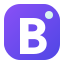

<div align="center">
  
  <h1>Baituna Studio</h1>
  <p>Website resmi Baituna Studio — premium, minimal, dan profesional.</p>

  <p>
    <a href="https://nextjs.org"></a>
    <a href="https://react.dev"></a>
    <a href="https://www.typescriptlang.org"></a>
    <a href="https://mantine.dev"></a>
    <a href="https://tailwindcss.com"></a>
    <a href="https://nextra.site"></a>
  </p>
</div>

Website ini dibangun dengan Next.js (App Router), Mantine UI, Tailwind CSS, dan Nextra (MDX) untuk menghadirkan pengalaman digital yang elegan, cepat, dan mudah dipelihara.

## Ringkasan

- **Landing page premium** untuk studio digital
- **Halaman**: layanan, portofolio, katalog, tentang, dan kontak
- **Konten MDX** via Nextra
- **Form kontak** dengan validasi + endpoint API
- **Responsive** + dukungan **light/dark mode**

## Tech Stack

- **Next.js 15** (App Router)
- **React 18**
- **TypeScript**
- **Mantine UI**
- **Tailwind CSS 4**
- **Nextra 4**
- **Zod**

## Fitur Utama

- **Hero & marketing layout** bergaya premium
- **Navigasi responsif** (mobile drawer)
- **Komponen** layanan, portofolio, testimonial, CTA
- **Halaman MDX** untuk katalog & studi kasus
- **Contact form** (validasi client & server)
- **Theme system** (light/dark)

## Preview

- **Local**: `http://localhost:3000`

## Menjalankan Proyek

### 1. Install dependency

```bash
npm install
```

### 2. Jalankan development server

```bash
npm run dev
```

### 3. Build untuk production

```bash
npm run build
```

### 4. Jalankan hasil build

```bash
npm run start
```

## Script Tersedia

- `npm run dev` - menjalankan aplikasi dalam mode development
- `npm run build` - build produksi
- `npm run start` - menjalankan hasil build
- `npm run lint` - menjalankan pengecekan lint

## Struktur Proyek

```text
app/            Route App Router, halaman, API, dan layout
components/     Komponen UI reusable
lib/            Konfigurasi site, theme, dan validasi
public/         Aset statis seperti favicon dan gambar
theme.config.tsx Konfigurasi tema Nextra
mdx-components.tsx Override komponen MDX global
```

## Panduan Konten (MDX)

- Halaman MDX berada di `app/**/page.mdx`
- Jika menulis blok HTML di MDX, **hindari nesting `<p>` di dalam `<p>`** (dapat memicu hydration error). Gunakan `<div>` untuk wrapper teks.

## Deployment

Proyek ini siap dijalankan sebagai aplikasi Next.js. Pastikan environment produksi, domain, dan target deploy sudah disesuaikan dengan platform hosting yang digunakan.

## Catatan

- Dokumentasi konten halaman dikelola melalui file MDX di folder `app/`.
- Gaya visual difokuskan pada kesan premium, minimal, dan profesional.
